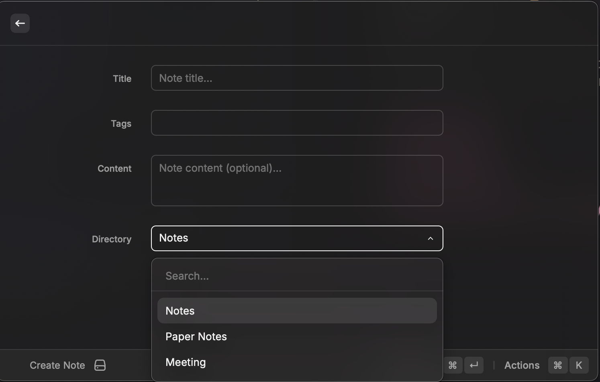
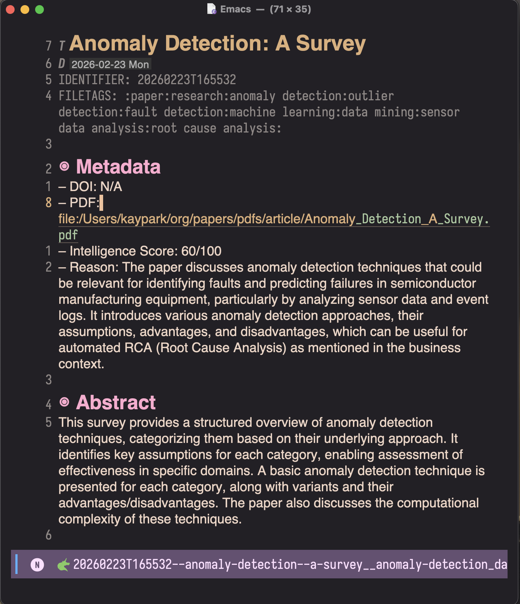

#+title: Raycast Denote
#+author: Kay Park
#+description: Create, search, and manage denote notes from Raycast with Emacs integration

* Raycast Denote

Create, search, and manage [[https://protesilaos.com/emacs/denote][denote]] notes from [[https://raycast.com][Raycast]].

Bridges Raycast's quick launcher with Emacs [[https://protesilaos.com/emacs/denote][denote]] — the simple, predictable note-naming system. Open notes in Emacs GUI via =emacsclient=, search your BibTeX library, and capture thoughts instantly.

** Screenshots

#+caption: Create Note — title, tags (autocomplete from existing), content

#+caption: Search Papers — search bibliography, open PDFs, create paper notes

** Commands

| Command          | Description                                                           |
|------------------+-----------------------------------------------------------------------|
| *Create Note*    | Form with title, tags (autocomplete from existing), content, dir pick |
| *Search Notes*   | Fuzzy search across all denote notes by title, tags, or content       |
| *Search Papers*  | Search bibliography.bib by title/author/year, open PDFs               |
| *Quick Capture*  | Minimal input — type a thought, press Enter, done                     |

** Actions

*** Search Notes
- =Enter= — Open in Emacs GUI (=emacsclient -c -n=)
- =Cmd+C= — Copy file path
- =Cmd+Shift+C= — Copy denote link =[[denote:ID]]=

*** Search Papers
- =Enter= — Open PDF in Preview.app
- =Cmd+Enter= — Open paper note in Emacs (if exists)
- =Cmd+N= — Create new paper note from bib entry
- =Cmd+D= — Open DOI in browser

** Emacs Integration

This extension is designed to work with Emacs in daemon mode. Notes open in a new Emacs GUI frame via =emacsclient -c -n=.

*** Automatic =emacsclient= Discovery

Raycast runs with a minimal PATH, so the extension auto-resolves =emacsclient= at runtime. You can just set =emacsclient -c -n= in preferences — no full path needed.

Searched locations (first match wins):

| Install method   | Path                                                     |
|------------------+----------------------------------------------------------|
| MacPorts app     | =/Applications/MacPorts/Emacs.app/.../bin/emacsclient=   |
| Emacs.app        | =/Applications/Emacs.app/.../bin/emacsclient=            |
| Homebrew (ARM)   | =/opt/homebrew/bin/emacsclient=                          |
| Homebrew (Intel) | =/usr/local/bin/emacsclient=                             |
| MacPorts CLI     | =/opt/local/bin/emacsclient=                             |
| Linux system     | =/usr/bin/emacsclient=                                   |
| Snap             | =/snap/bin/emacsclient=                                  |

The server socket is also auto-detected: =~/.config/emacs/server/= → =~/.emacs.d/server/= → =/tmp/emacs{uid}/=.

*** My Emacs Config

My Emacs configuration: [[https://github.com/kayspark/emacs.d][kayspark/emacs.d]] — a minimal-emacs.d setup with:
- *Evil mode* + general.el (=SPC= leader) + which-key
- *Denote* for note management with org-mode
- *Vertico + Corfu + Consult + Embark* for completion
- Daemon mode via LaunchAgent for instant startup

The editor command is configurable in preferences — any editor that accepts a file path argument will work.

** Requirements

- [[https://raycast.com][Raycast]]
- [[https://www.gnu.org/software/emacs/][Emacs]] with daemon mode (=emacsclient=)
- [[https://github.com/BurntSushi/ripgrep][ripgrep]] (=rg=) for fast note search
- Org files using [[https://protesilaos.com/emacs/denote][denote]] naming convention

** Setup

#+begin_src bash
git clone https://github.com/kayspark/raycast-denote.git
cd raycast-denote
npm install
npm run build
#+end_src

After =npm run build=, the commands are permanently available in Raycast. No dev server needed.

Configure paths in Raycast extension preferences (=Cmd+,= on any Denote command).

** Preferences

| Setting            | Default                         | Description                      |
|--------------------+---------------------------------+----------------------------------|
| Notes Directory    | =~/org/notes=                   | Where denote notes live          |
| Papers Directory   | =~/org/papers=                  | Papers dir (with =notes/= subdir) |
| Inbox Directory    | =~/org/inbox=                   | Quick capture destination        |
| Bibliography File  | =~/org/papers/bibliography.bib= | BibTeX file for paper search     |
| Editor Command     | =emacsclient -c -n=            | Command to open notes            |

** Denote File Format

Files follow the [[https://protesilaos.com/emacs/denote#h:4e9c7512-84dc-4dfb-9fa9-e15d51178e5d][denote naming convention]]:

#+begin_example
YYYYMMDDTHHMMSS--slugified-title__tag1_tag2.org
#+end_example

With front matter:

#+begin_src org
,#+title:      My Note Title
,#+date:       [2026-02-28 Fri]
,#+identifier: 20260228T143022
,#+filetags:   :tag1:tag2:
#+end_src

** How It Works

- *Tag autocomplete* — scans =#+filetags:= headers across all note directories with =rg=
- *Note search* — =rg -l -i= for full-text search, filename parsing for title/tag display
- *Paper search* — regex-based BibTeX parser, PDF path extraction (supports Zotero-style file fields)
- *Note creation* — generates denote-compliant filenames and org front matter

** License

MIT
